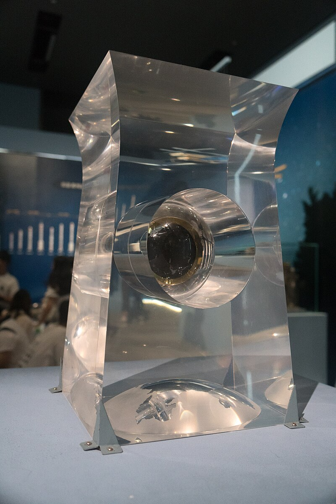
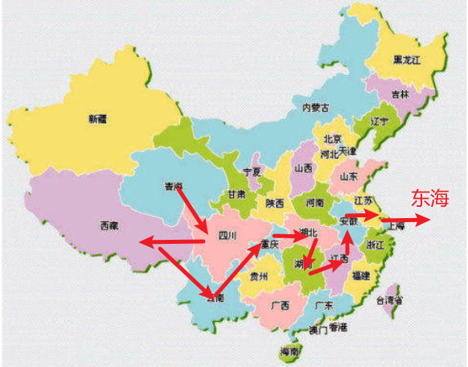
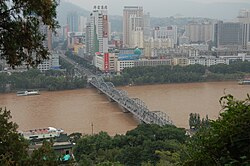
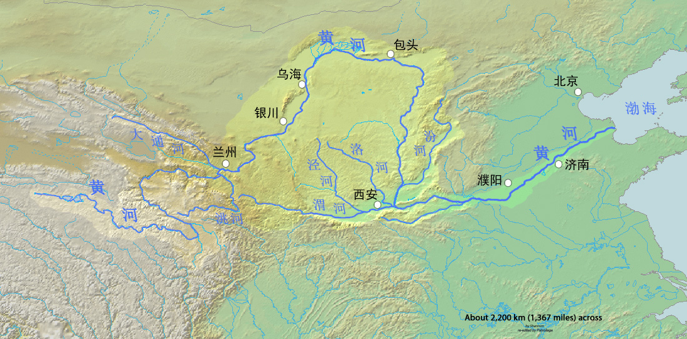
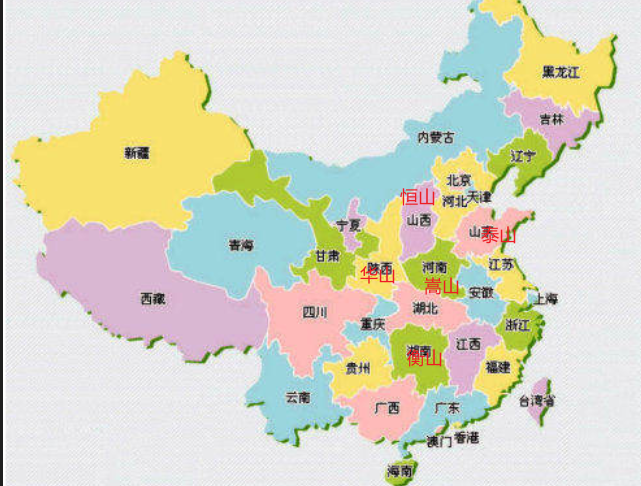

1. 天文
2. 地理
3. 科技
4. 金融
5. 成语
6. 二十四节气
7. 历史
8. 抗日
9. 人体
10. 法律
11. 组织
12. 其他
13.

# 错题集

## 天文

### 太阳系中距离太阳第二近的行星是？

::: 距离

1. 水星
2. 金星
3. 地球
4. 火星
5. 木星
6. 土星
7. 天王星
8. 海王星
   :::
   :::体积
9. 木星（体积最大）
10. 土星
11. 天王星
12. 海王星
13. 地球
14. 金星
15. 火星
16. 水星（体积最小）
    :::
### 中国四大航天发射场（武威-甘肃、酒泉-甘肃、太原-山西、西昌-四川）后新增文昌发射场（2016年启用-海南）
### 嫦娥系列航天器-“绕、落、回”
1. 嫦娥一号 获取覆盖全月面的地形图，矿物分布，监测月-地之间的空间环境（2007）“绕”
2. 嫦娥二号 试验、验证部分新技术和新设备，太阳风粒子探测（2010）
3. 嫦娥三号 月球软着陆（2013）“落”
4. 嫦娥四号 月球中继通信卫星，首次月球背面软着陆和巡视探测（2018）
5. 嫦娥五号 地外天体自动采样返回（2020）“回”
  
6. 嫦娥六号  探月背（）
7. 嫦娥七号核心任务为探测月球南极永久阴影坑水冰
### 天问一号（地火）（2020 年 7 月 23 日 12 时 41 分）

1. 天问一号是中国首次火星探测任务，实现绕、落、巡一步到位
2. 天问一号任务由长征五号运载火箭负责发射并直接送入地火转移轨道
3. 发射地点为 2014 年建成的海南文昌航天发射场（中国最先进、纬度最低的发射场，可为火箭提供最大运力，也是唯一有能力进行长征五号发射的发射场。）
4. 中国最早的火星任务萤火一号，与俄罗斯合作的主要原因之一，即为中国在当时尚未拥有真正的深空测控网
5. 火星部署火星车（祝融号-2021）
6. 火星一号（2018 年至 2020 年）

### 神舟十八号（地月）（2024 年 4 月 25 日-2024 年 11 月 4 日）

1. 任务周期为 6 个月（2024 年标准化驻留）（第十三次载人飞行任务）
2. 酒泉卫星发射中心
3. 将宇航员送往中国的空间站（如天宫空间站）。
4. 进行科学实验和技术验证。
5. 进行空间站的建设与维护。
6. 乘组人员：叶光富、李聪、李广苏
7. 第一次航天员出舱活动长达 8 小时 23 分钟
8. 192 天的在轨时间
9. 我国首个实现太空行走的宇航员是翟志刚（2008 年神舟七号）
10. 中国首位进入太空的宇航员杨利伟（2003 年神舟五号）

### 墨子号(2016 年 8 月 16 日)

1. 我国首颗量子卫星

### 北斗系统

1. 特有短报文通信功能，GPS 等系统不具备

### 我国第四发射场为 2014 年建成的海南文昌（其他三个：酒泉/太原/西昌）

## 地理

### 长江发源于：

正确答案: 唐古拉山
解析: 长江正源沱沱河发源于唐古拉山脉主峰各拉丹冬雪山（地理常识）。

1. 源流主要有沱沱河、当曲和楚玛尔河三支，其中沱沱为长江正源
2. 又名扬子江，古称江水、大江，简称江，是亚洲第一长河和世界第三长河，全长 6300 公里
3. 干流发源于青藏高原东部 唐古拉山脉 各拉丹冬峰
4. 穿越中国西南（青海、西藏、云南、四川、重庆）、中部（湖北、湖南、江西）、东部（安徽、江苏），在上海市汇入东海
5. 长江干流流经青海、四川、西藏、云南、重庆、湖北、湖南、江西、安徽、江苏、上海（11 个省）
6. 各河段的名称
7. 长江桥隧
   :::
   1957 年，第一座长江大桥武汉长江大桥通车。

   2008 年，第一条下穿长江的隧道武汉长江隧道通车试运行。

   2012 年，第一条下穿长江的地铁隧道武汉地铁 2 号线过江隧道通车试运行。
   :::

8. 长江三峡自西向东：瞿塘峡（重庆奉节）→ 巫峡 → 西陵峡
   ::: 北魏时郦道元《水经注》描述三峡：
   自三峡七百里中，两岸连山，略无阙处。重岩叠嶂，隐天蔽日，自非亭午夜分，不见曦月。 至于夏水襄陵，沿溯阻绝。或王命急宣，有时朝发白帝，暮到江陵，其间千二百里，虽乘奔御风，不以疾也。
   春冬之时，则素湍绿潭，回清倒影。绝𪩘多生怪柏，悬泉瀑布，飞漱其间。清荣峻茂，良多趣味。 每至晴初霜旦，林寒涧肃，常有高猿长啸，属引凄异，空谷传响，哀转久绝。故渔者歌曰：“巴东三峡巫峡长，猿鸣三声泪沾裳。”
   :::

### 黄河生态核心区

库布其沙漠
解析：《黄河保护法》第 42 条将库布其列为生态核心区（内蒙古段），因其治沙成功模式

1. 黄河源头： 巴颜喀拉山（青海），内蒙古自治区托克托县河口镇
2. 黄河在中国古代称作河水、大河，简称河，仅次于长江，也是世界第五长河流
3. 依次穿越青藏高原、黄土高原、内蒙古高原、华北平原的青海、四川、甘肃、宁夏、内蒙古、陕西、山西、河南、山东 9 个省区，最后于山东省东营市垦利区黄河口镇注入渤海（莱州湾）
4. 干流全长 5464 千米，流域总面积 79.5 万平方公里
   
   
   

### 雅鲁藏布江-我国最长的高原河流（全长约 2900 公里）

### 世界上流量最大的河流是？

A. 尼罗河 B. 亚马逊河 C. 长江 D. 密西西比河
解析: 亚马逊河是世界流量最大的河流（平均流量约 20 万 m³/s），尼罗河是最长的但流量较小

### 中国四大盆地纬度排序：

:::

1. 准噶尔（44°N）最高；(新疆)
2. 塔里木（41°N）(新疆)
3. 柴达木（37°N）(青海)
4. 四川（30°N）最低；(三星堆,都江堰)
   :::
### 三山
蓬莱、瀛洲、方丈，或实指天山、长白山、昆仑山
### 五岳
1. 泰山-东岳-山东中部
2. 衡山-南岳-湖南
3. 华山-西岳-陕西
4. 恒山-北岳-山西
5. 嵩山-中岳-河南

### 四大佛教名山
1. 四川峨眉山以"金顶佛光"奇观闻名
   
2. 五台山为文殊道场 (山西-智慧)
3. 普陀山为观音道场（浙江省舟山市普陀区）
4. 九华山地藏道场（安徽省池州市青阳县）
### 我国地势第一级阶梯的主要地形: 青藏高原、黄土高原（1000 米以上）

### 我国地势第二级阶梯的主要地形: 黄土高原、云贵高原、四川盆地等

### 世界最长沙漠公路“塔克拉玛干沙漠公路”位于我国哪个省级行政区？

正确选项：C（新疆维吾尔自治区）

解析：塔克拉玛干沙漠公路位于新疆塔里木盆地，贯穿中国最大沙漠——塔克拉玛干沙漠。

### 欧洲多瑙河流经的最后一个国家（注入黑海前）是？

正确选项：C（罗马尼亚）

解析：多瑙河流经多个国家，最后在罗马尼亚注入黑海。德国、匈牙利是流经的上中游国家，乌克兰也是流经国，但多瑙河三角洲主要在罗马尼亚。

## 科技

### 我国特高压输电最高电压等级 为 ±1100kV（昌吉—古泉工程）

### 国产 C919 大飞机由中国商用飞机有限责任公司研制（2017）

### 亚洲首艘专业消防救援船"深海 01"于 2021 年在深圳投用。

### 中国首艘自主研制大型邮轮 命名为"爱达·魔都号"（2023 年 11 月 4 日）

### FAST 探测纳赫兹引力波 成果 2023 年发表于《Nature》。（2023 年 6 月 9）

### 鹏城实验室 是 2023 年正式批复的国家实验室之一

### 量子保密通信"京沪干线"全长约 2000 公里（北京至上海）

### CR929 是 中俄联合研制的远程宽体客机，定位洲际航线。

## 成语

## 二十四节气

### 二十四节气中，象征昼夜平分的节气是：

选项: A.立春 B.谷雨 C.夏至 D.春分

正确答案: D (春分)
解析: 春分和秋分日夜平分；夏至昼最长。

### "二十四节气"中最早确定的节气是？

正确答案：C. 冬至（二十四节气最早确定的应是冬至和夏至，但冬至通常被认为是第一个确定的，用于制定历法。参考历史知识）

## 计算

### 一本书按原价卖可赚 25%，打八折后盈利 40 元。原价是多少元？

A. 200 B. 240 C. 280 D. 320

## 历史

夏商周
秦汉
三国
两晋
南北
隋
唐宋元明清

### 关键事件线：秦（法家）→ 汉初（黄老）→ 西汉（独尊儒术）→ 唐（三教并行）。

### 南昌滕王阁、武汉黄鹤楼、岳阳岳阳楼

### 丝绸之路（汉朝）西端终点是罗马帝国（汉称大秦），波斯为中途枢纽

:::
陆上丝绸之路从中国西部出发，经过中亚，最终抵达欧洲；
海上丝绸之路则从中国沿海城市出发，经过南海、印度洋，连接到东非和欧洲。
:::
### 西汉《汜胜之书》是最早农书（佚文见《齐民要术》）
西汉《汜胜》→北魏《齐要》→明清《农政》

### 《永乐大典》为明成祖朱棣命解缙等编纂

### 唐朝时期的中央政府机构-三省六部

#### 三省

1. 中书省：负责起草和发布政令。
2. 门下省：负责审议和决策，具有对中书省的监督权。
3. 尚书省：负责具体的行政管理和执行

#### 六部（尚书省）

六部是尚书省下属的各个部门，分别为：

1. 吏部：负责官员的任命和考核。
2. 户部：负责财政和税收。
3. 礼部：负责礼仪、教育和宗教事务。
4. 兵部：负责军队和军事事务。
5. 刑部：负责司法和刑事案件。
6. 工部：负责工程、建筑和公共设施。
### 清朝的中央政府机构-内阁（军机处）

#### 中央机构

皇帝：清朝的最高统治者，拥有绝对的权力。
内阁：由大学士组成，负责处理日常政务和建议皇帝决策。
军机处：专门处理军事和重要政务的机构，后期权力逐渐增强，成为实际的决策中心。

#### 六部

与前朝类似，清朝也设有六部，负责不同领域的行政管理：

吏部：负责官员的任命、考核和管理。
户部：负责财政、税收和户籍管理。
礼部：负责礼仪、教育和宗教事务。
兵部：负责军队的管理和军事事务。
刑部：负责司法和刑事案件的审理。
工部：负责工程、建设和公共设施的管理。

#### 其他重要机构

大理寺：负责司法审判的最高机构。
东厂和西厂：特务机构，用于监视和处理异议。
各省督抚：负责地方行政和军事，直接向中央报告。

#### 地方机构

清朝的地方行政系统由省、府、县等层级组成，省级由督抚管理，府级由知府管理，县级由县令管理。

这种机构设置有效地维护了清朝的统治，但也随着历史的发展而不断调整和变化。
旧官制
中枢部
内三院 → 内阁 → 军机处六部 吏部户部礼部兵部刑部工部
佐理部
奉天五部都察院 六科大理寺理藩院翰林院 春坊通政司国子监 春坊钦天监
帝室部
宗人府内务府 → 十三衙门 → 内务府詹事府太常寺光禄寺太仆寺鸿胪寺太医院
新官制
（1911 年）
内阁
总理大臣协理大臣外务部吏部民政部度支部学部陆军部海军部法部农工商部邮传部理藩部
其他
弼德院法制院典礼院资政院翰林院大理院军咨府盐政院宗人府内务府钦天监太医院

## 抗日

### 中国抗战胜利纪念日？

选项：A. 9 月 3 日 B. 8 月 15 日 C. 9 月 2 日 D. 8 月 14 日
正确解答：A. 9 月 3 日
解析：国家法定纪念日为 9 月 3 日（日本签署投降书次日）。

## 人体

### 人体中，负责运输氧气的主要器官是？

A. 心脏 B. 肺 C. 大脑 D. 肝脏
正确答案： A
解析：负责运输氧气的主要器官是心脏，它通过泵血将氧气输送到全身细胞。肺负责气体交换（吸入氧气），但运输氧气由循环系统主导，核心器官是心脏。选项 B（肺）错误。您的答案 B 错误，因生物学常识强调心脏的运输作用。

## 法律

### 《宪法》

:::info

- 宪法》规定，年满 16 岁的公民享有劳动权利和义务
  :::

### 民法典(2021 年 1 月 1 )

1. 民法典第 188 条：民事权利诉讼时效期间为 3 年

### 数据安全法（2021-9-1）

### 新《安全生产法》（2021-9-1）

### 我国首部《无障碍环境建设法》施行日期（2021-9-1）

### 个人信息保护法（2021 年 11 月 1 日）

### 野生动物保护法（2023 年 7 月 1 日）

### 新修订 海洋环境保护法（2024-1-1）

### 爱国主义教育法 （2024-1-1）

### 《保守国家秘密法》第 15 条：绝密级 ≤30 年，机密级 ≤20 年，秘密级 ≤10 年。(2024年5月1)

2024 年 5 月 1 日起施行

### 税

1. 2024 年小规模纳税人增值税起征点为季度销售额 45 万元。

## 金融
### 中国首个自贸试验区2013年设立于上海,海南为全岛自贸港。
### 再贴现率 是央行对商业银行的放贷利率，降低后商业银行融资成本下降 → 社会贷款利率降低

### 存款准备金率 存款准备金率下降 → 银行可贷资金增加 → 货币供应量上升。

### 一篮子货币是指由多个国家的货币组成的一个集合，通常用于衡量某种货币的价值或进行国际贸易时的汇率计算。
### "看不见的手"：指市场自发调节供需 （亚当·斯密提出）
### 吉芬商品：（如低档必须品）具有“价格↑需求↑，价格↓需求↓”的反常特性
### K线图由日本江户时代米商本间宗久发明
### 美国为现代金融理论发源地
### 世界银行 提供长期贷款支持发展中国家基建
### 国际货币基金组织 主攻短期金融稳定
### 世界贸易组织 调解贸易争端
### 国际清算银行 清算服务
:::info
存款准备金率是指商业银行在中央银行存放的准备金与其存款总额之间的比例。这个比例由中央银行设定，用于调控货币供应量和维护金融稳定。
:::

## 组织

### 国务院（行政机关）

1. 国务院制定行政法规
2. 2023 年国务院机构改革新组建 国家金融监督管理总局
3. 国务院是国家最高行政机关。

### 国家监察委员会（行政机关）

1. 2018 年宪法修正案确立了国家监察委员会，负责对所有行使公权力的公职人员进行监督，实现国家监察全面覆盖

### 全国人民代表大会（权力机关）

1. 《宪法》第 57 条，全国人大是最高国家权力机关和立法机关
2. 《宪法》第 62 条：全国人大选举国家监委主任、最高法院院长、最高检检察长。
3. 全国人大首个基层立法联系点: 上海市长宁区虹桥街道(2015 年)

## 节日

### 《中华人民共和国国家安全法》规定的国家安全教育日是每年的？

正确答案：A（4 月 15 日）
解析：该法第 76 条确立每年 4 月 15 日为国家安全教育日；选项 C（6 月 15 日）是防范非法集资宣传日。

### 2024 年博鳌亚洲论坛主题是

2024 年主题为"亚洲与世界：共同的挑战，共同的责任"
2024年博鳌亚洲论坛主题为“亚洲与世界：共同的挑战，共同的责任”
### 奥运会

1. 国际奥委会总部 1915 年设于瑞士洛桑；雅典为现代奥运会发源地
2. 2024 巴黎奥运
   2.1 新增霹雳舞

### 中亚峰会 2023

首届中国—中亚峰会于 2023 年 5 月（非 2024 年）在西安（A）召开

## 国际

### 联合国总部设于美国纽约曼哈顿

1. 常任理事国：中法俄英美

### RCEP（区域全面经济伙伴关系协定）

:::info
成立时间：RCEP 于 2020 年 11 月 15 日正式签署。
成员国：RCEP 包括 15 个国家：

- 东盟十国：印度尼西亚、马来西亚、菲律宾、新加坡、泰国、文莱、越南、缅甸、老挝、柬埔寨
- 其他国家：中国、日本、韩国、澳大利亚、新西兰
  主要内容:
- 关税减让：成员国承诺逐步降低商品贸易的关税，促进贸易流通。
- 服务贸易：扩大服务贸易的市场准入，促进跨境服务的自由流动。
- 投资规则：设定投资保护和争端解决机制，保障投资者的权益。
- 知识产权：加强知识产权的保护和合作，促进创新和技术转移。
  :::

## 其他

### 导热性银>铜>金>铝

### 导电性银>铜>金>铝
### 声速在固体>液体>气体；铁中≈5120m/s，水≈1500m/s，空气≈340m/s，真空不传声。
### 触电时人体受损最严重的组织是：神经

### 鲨鱼是鱼类（用鳃呼吸）不属于哺乳动物
### 二十四史以西汉司马迁《史记》为首
### 2023 年中国新增世界灌溉工程遗产（安徽七门堰）
### 中国古代最早系统阐述中医理论的著作是《黄帝内经》

解析：《黄帝内经》是现存最早的系统中医理论著作，成书于战国至汉代。其他选项：《本草纲目》是明代药典，《伤寒杂病论》是东汉张仲景所著，《千金方》是唐代孙思邈所编。
### 全球首个商用海底数据中心2023年部署于海南陵水
### 2024 年 6 月 15 日（星期六）→2049 年 10 月 1 日

解析：2024 年 6 月 15 日（星期六）→2049 年 10 月 1 日，总天数差：

2024 年剩余：200 天（6 月 15 日后：16 天+31+31+30+31+30+31=200）
2025-2048 年：24 年 ×365 + 7 闰年日（2028、2032、2036、2040、2044、2048） = 8760 + 7 = 8767 天
2049 年 1/1 至 10/1：274 天（31+28+31+30+31+30+31+31+30+1）
总天数：200 + 8767 + 274 = 9241 天 ÷ 7 = 1320 周余 1 天 → 星期六后 1 天为星期日？重新计算：
正确天数：2024/6/15 至 2049/6/15 为 25 年，其中闰年 7 个（2024、2028...2048），天数 25×365+7=9132。2049/6/15 至 10/1：108 天（6 月 15 日后 15 天+7 月 31+8 月 31+9 月 30+10 月 1=15+31+31+30+1=108），总计 9132+108=9240 天 → 9240÷7=1320 整除 → 原星期六仍为星期六。实际应用日期计算规则。
您的答案：C ✘（错误，您选星期五；闰年计算或起始日未包含）
### 中国标准轨距为 1435 毫米（国际通用）

### 碳信用机制是碳交易市场的基础工具
### 澜沧江-湄公河合作机制成立于2016
1. 政治安全事务(高层交往和政治对话合作;执法、司法合作;打击跨国犯罪)
2. 经济与可持续发展(农业,贸易)
3. 社会人文合作(旅游)
### 全球发展倡议核心理念强调"互利共赢、共同发展"

### 中国承诺 2060 年实现碳中和(碳达峰 2030)

### 2023 年诺贝尔经济学奖授予 Claudia Goldin，表彰其对性别平等研究的贡献

### 努利原理：流体流速快压强小（如飞机升力机制）
### 甲状腺是人体最大内分泌腺（重20-30g）
### 边际效用递减

1. 经济学概念指每新增一单位消费品带来的效用增量减少（新增消费的满足感降低）

